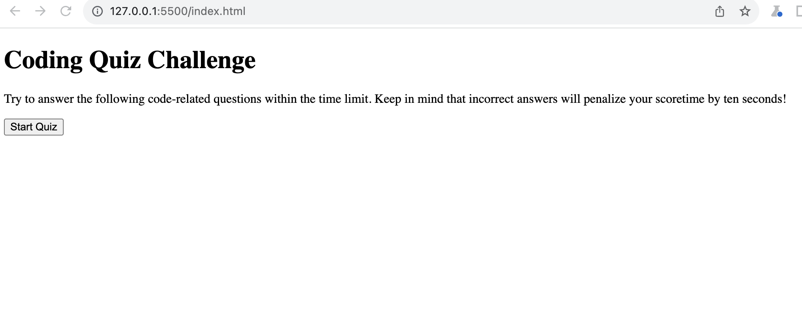

# Code Quiz

## What has been done

- created question bank with multiple choice answers
- start button fires up the timer count and first question is presented
- after answering the question another question is presented
- if answer is incorrect timer goes down by 10 seconds
- when all the questions are answered or timer reaches 0 game stops
- after the game stops, user can save initials and score

## Live URL can be found here:

https://yuliyatsoy.github.io/code-quiz/

## Application appearance is as follows:

